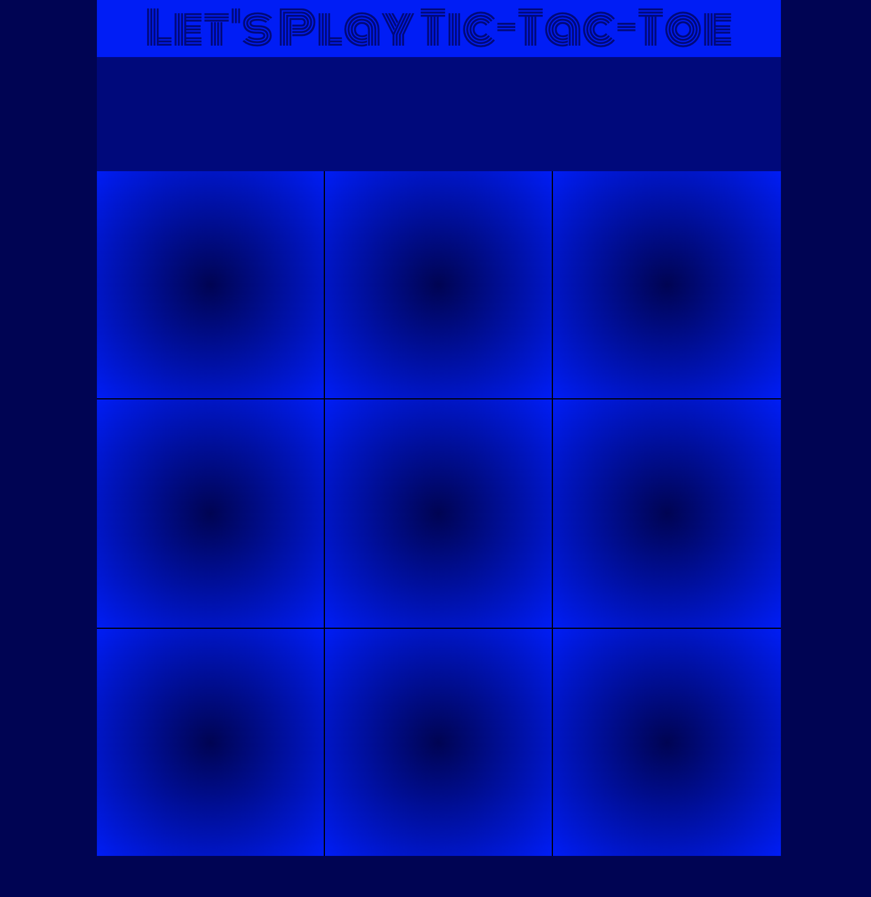

# Tic-Tac-Toe

<hr>
This is a project to practice Vanilla Javascript fundamentals including: arrays, nodelists, conditional logic, and functions.
<hr>

**Link to project:** godwinkamau.github.io/tic-tac-toe/



## How It's Made:
Tech used: HTML, CSS, JavaScript

In the **HTML**, I referenced the squares with their own class in order to manipulate them in the JavaScript.

In terms of the **CSS**, I used grid to make the layout of the game board and flex for everything else. I also used some nice fonts from google.

For the **JavaScript**, I wanted each sqaure to have the action of filling itself with either an "X" or an "O" once it is clicked. In order to accomplish this, I referenced the sqaure class and put them in a NodeList with `document.querySelector('.square')`. After that, I looped through the list and gave them all an event listener. It looked something like this:
```
const squares = document.querySelectorAll('.square') //Collecting all the squares into a NodeList
squares.forEach((square,i) => {                     //for each square,
  squre.addEventListener('click',() => {            //add an event listener
    if (square.innerHTML === '') {                  //check if it is empty
      turnOrder(square,i)                          //pass the information to another function
    }
  })
})
```
After the squares were figured out, I started constructing the game logic. I noted all of the possible win conditions into an array (each win condition inside of its own array within the larger array). When a square was pressed, I took the index of that square and passed it through the array. If the index was found, I would replace the number in the array with "X" or "O". If all of the elements in a single array were all X's or O's, the game would end. Here are some key pieces of code for that logic:
```
const winArray = [[<win combo 1>],[<win combo 2>], etc.]

function checkForWin(i){
  winArray.forEach((win,index) => {         //loop through the array, the i is taken from the last function referring to the square clicked
    if (win.includes(i)) {
        const position = win.indexOf(i)
        win.splice(position, 1, player)
    }
  })
}
```

<hr />

### Lessons Learned:
This exercise was great to learn about using .forEach() to set up anonymous functions and loop through large amounts of information efficiently. It also taught me more about how to properly manipulate the DOM with JavaScript. For example, I used .innerHTML to place the X's and O's. 

Furthermore, I also learned about setting up functions in a more modular way to help organize the game logic and make it more readable.